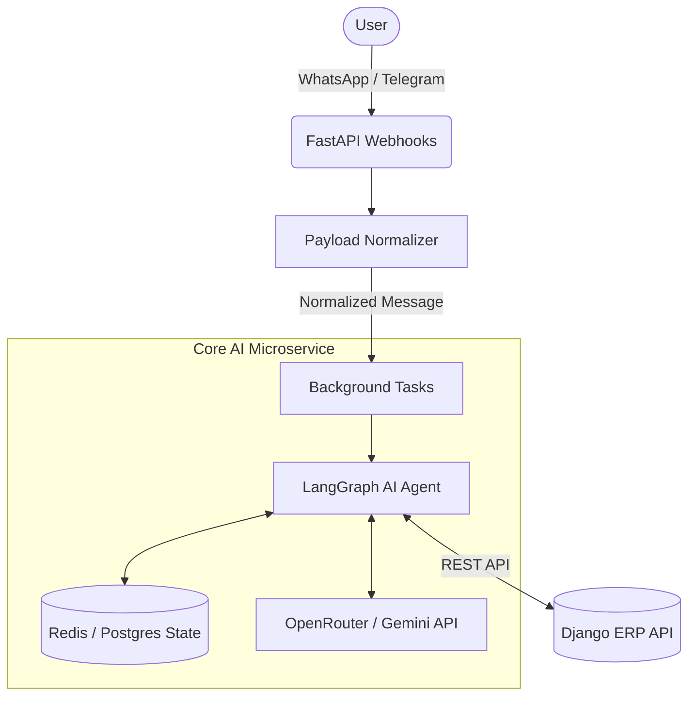
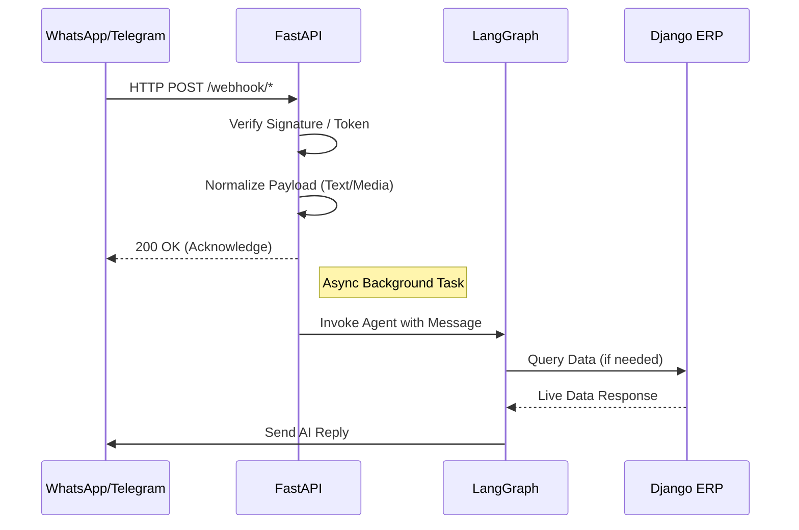

# Omnichannel AI Chatbot

A fast, scalable, and intelligent omnichannel microservice designed to act as an AI chatbot for WhatsApp and Telegram. Powered by **FastAPI**, **LangGraph**, **OpenRouter** (Primary), and **Google Gemini** (Fallback), this bot seamlessly fetches live data from a Django ERP system, maintaining a strict policy of "No Local Business DB" to ensure a single source of truth.

## Key Features

*   **Omnichannel Support**: Handles both WhatsApp and Telegram webhooks natively.
*   **Platform-Agnostic Logic**: Core LangGraph AI agent logic is decoupled from platform-specific payload formats.
*   **Multimodal AI**: Leverages Google Gemini for processing text, images, and audio.
*   **Stateful Conversations**: Uses LangGraph Checkpointers (Redis/Postgres) to maintain chat context across sessions.
*   **Django ERP Integration**: Directly queries the central Django ERP API for live product, stock, and pricing data.
*   **Async First**: Built entirely on `async/await` for high concurrency and performance.

---

## Tech Stack

*   **Framework**: [FastAPI](https://fastapi.tiangolo.com/) & Uvicorn
*   **AI & Orchestration**: [LangChain](https://python.langchain.com/) & [LangGraph](https://langchain-ai.github.io/langgraph/)
*   **LLM Provider**: OpenRouter (Primary) & Google Gemini (`langchain-google-genai`) (Fallback)
*   **State Persistence**: Redis & PostgreSQL (`langgraph-checkpoint-redis`, `langgraph-checkpoint-postgres`)
*   **HTTP Client**: `httpx` for asynchronous ERP requests

---

## Architecture & Flow

### High-Level Architecture


### Webhook Execution Flow


---

## Setup & Installation

You can run this project using either **Docker** (recommended) or **locally via Python venv**.

### Prerequisites
- Python 3.10+
- Redis Server
- PostgreSQL (if using postgres checkpointer)
- Environment variables configured (see `.env` section)

### Option 1: Docker (Recommended)

1. **Clone the repository:**
   ```bash
   git clone <repo-url>
   cd python-omnichannel-ai
   ```

2. **Setup Environment Variables:**
   ```bash
   cp .env.example .env
   # Fill in the necessary secrets in .env
   ```

3. **Build and Run:**
   ```bash
   docker-compose up --build -d
   ```

### Option 2: Local Setup (venv + Uvicorn)

1. **Clone the repository:**
   ```bash
   git clone <repo-url>
   cd python-omnichannel-ai
   ```

2. **Create and activate a virtual environment:**
   ```bash
   python -m venv venv
   # On Windows:
   venv\Scripts\activate
   # On Linux/macOS:
   source venv/bin/activate
   ```

3. **Install dependencies:**
   ```bash
   pip install -r requirements.txt
   ```

4. **Setup Environment Variables:**
   ```bash
   cp .env.example .env
   # Fill in the necessary secrets in .env
   ```

5. **Run the FastAPI server:**
   ```bash
   python run.py
   ```

---

## 📜 Utility Scripts

*   `run.py`: Entry point to run the FastAPI application.
*   `generate-telegram-secret.py`: Generates the Telegram secret token.
*   `scripts/`: Contains data ingestion, cleaning, and ERP synchronization scripts.

---

## ⚙️ Environment Variables (`.env`)

Here are the key environment variables required to run the service:

### WhatsApp Cloud API
*   `WHATSAPP_PHONE_NUMBER_ID`
*   `WHATSAPP_ACCESS_TOKEN`
*   `WHATSAPP_APP_SECRET`
*   `WHATSAPP_WEBHOOK_VERIFY_TOKEN`
*   `WHATSAPP_API_VERSION`

### Telegram Bot API
*   `TELEGRAM_BOT_TOKEN`
*   `TELEGRAM_SECRET_TOKEN`
*   `NGROK_URL` (Required for local webhook registration)

### AI Providers
*   `GEMINI_API_KEY`
*   `OPENROUTER_API_KEY`

### Django ERP Integration
*   `ERP_BASE_URL` (e.g., https://erp.yourdomain.com)
*   `ERP_API_TOKEN`
*   `ERP_USERNAME`
*   `ERP_PASSWORD`
*   `ERP_DB_URL`

### State Persistence
*   `REDIS_HOST` (default: localhost)
*   `REDIS_PORT` (default: 6379)

---

## 🛣️ API Routes

### General
*   `GET /health`: Health check endpoint.

### Webhooks
*   `GET /webhook/whatsapp`: WhatsApp webhook verification.
*   `POST /webhook/whatsapp`: Receives incoming WhatsApp messages.
*   `POST /webhook/telegram`: Receives incoming Telegram messages.

### Admin
*   `POST /admin/register-telegram-webhook`: Dynamically registers the Telegram webhook using your `NGROK_URL`.
